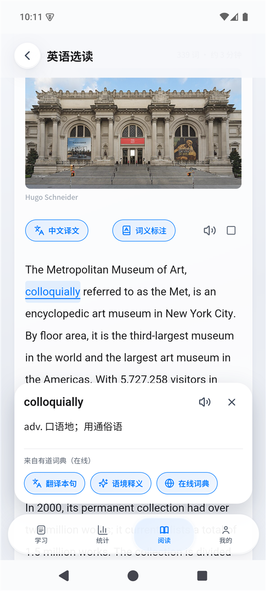
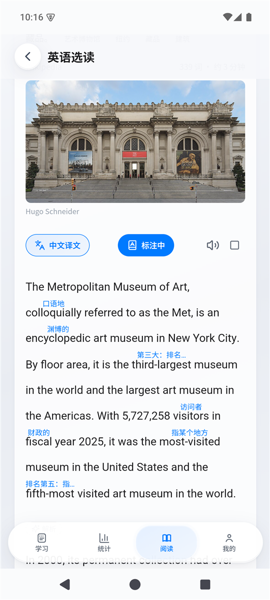

<div align="center">


# 拾词 Wordflow

**一个安静、克制的 Android 背单词应用：背词、复习、读文章，查词只需要点一下。**

[下载最新版](https://wordflow.43.134.190.112.sslip.io/releases/wordflow.apk) · [详细说明](docs/details.md) · [记忆模块设计](docs/word-learning-design.md)

</div>

<p align="center">
  
  &nbsp;&nbsp;
  
</p>

## 特点

- **背词**：按词书单元学习，每组最多 20 词。支持“看词”和“遮义自测”，每词有六级难词标记，随时撤销上一步。
- **复习**：默认艾宾浩斯式固定间隔（20 分钟、1 天、2 天、4 天、7 天、15 天、30 天），也可切换为 FSRS 自适应计划。可按天复习，到期词跨词书去重。
- **词书**：内置高考、四级、六级、考研、雅思、托福等词书，四级、六级、考研按近五年考频排序。也可导入 CSV、TSV、TXT。
- **阅读**：外刊式的每日英语选读，文章按 A2–C2 分级，附中文译文。点任意单词立即显示意思，可开“词义标注”直接在文中显示中文小字；句子和文章可用云端语音朗读。
- **语境记忆**：把当天的词放进一篇短文里读。
- **AI 只在需要时用**：点词翻译本句 / 语境释义，以及“语境记忆”短文（阅读页自选词，或学习页读本组短文）；没有聊天窗口，不在背词主流程里。每台设备每天有内置额度，详见 [AI 说明](docs/ai.md)。
- **本地优先**：学习数据保存在手机本地，离线可用，可手动备份，也可开通匿名云端保存（8 位恢复码，不需要手机号或邮箱）。
- **界面**：液态玻璃风格，支持浅色和深色，可调字体和字号，遵循“减少动画”等系统偏好。

## 安装

Android 7.0 及以上。下载 [最新 APK](https://wordflow.43.134.190.112.sslip.io/releases/wordflow.apk) 安装，首次需要在系统设置里允许“安装未知应用”。装好之后，应用内“我的 → 检查更新”会校验 `sha256` 并直接更新。

当前版本：**0.4.8**（versionCode 38，开发签名测试版）。

## 技术栈

| 部分 | 技术 |
| --- | --- |
| 界面 | React + TypeScript + Ionic + Vite |
| 安卓容器 | Capacitor（SQLite 存储、Keystore 加密、系统朗读、文件导出由原生代码处理） |
| 云端 | 一个 Python 小服务（`cloud/`）：匿名云备份、更新分发、在线选读库、AI 代理（额度与短文）、朗读代理 |
| 测试 | Node 单元测试、Playwright 网页回归、Python 服务测试 |

这不是 Kotlin/Compose 全原生界面，而是 WebView 里的 React 应用。

## 开发

需要 Node.js 24+，构建安卓包需要 JDK 21 和 Android SDK。

```powershell
npm install
npm run dev          # 浏览器预览，默认 http://localhost:4173
npm test             # 单元测试
npm run build
npx playwright test  # 网页回归，使用独立临时数据库
python tests/cloud_test.py
```

构建 APK：

```powershell
$env:JAVA_HOME = 'D:\APPS\Android\Android Studio\jbr'
$env:ANDROID_HOME = 'D:\APPS\Android\Sdk'
npx cap sync android
.\android\gradlew.bat -p android :app:assembleDebug
```

更多内容（学习与复习规则、词书与考频数据来源、选读库、备份与云端保存、安卓端测试）见 [详细说明](docs/details.md)。

## 数据与许可

- 词典数据来自 [ECDICT](https://github.com/skywind3000/ECDICT)，许可随包附带（`public/vocabulary/ECDICT-LICENSE.txt`）。
- 英语选读的英文为维基百科原文节选（CC BY-SA），署名、许可和图片来源随文章保留；译文和难度分级由 AI 辅助生成，仅供参考。
- 近五年考频来自第三方真题页面的独立计数，非官方统计。
- 项目暂未声明开源许可证，如需复用代码请先联系作者。
